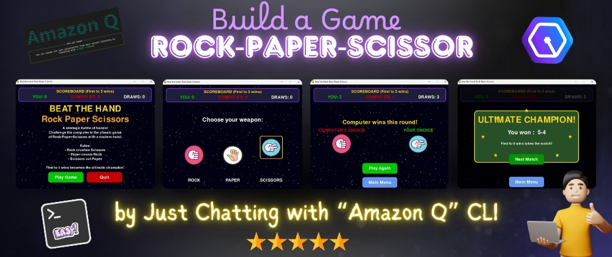

# 🚀 Rock Paper Scissors: Space Edition 🌌

A modern twist on the classic **Rock, Paper, Scissors** game - now set in **space**!  
Built with **Amazon Q CLI** and **Pygame**, this project showcases interactive visuals, smooth transitions, and a sleek space-themed design.

---



## ✨ Features

- 🌠 **Space-Themed Interface**  
  Dive into a cosmic UI with stars, planets, and glowing visuals.

- 🎮 **Classic Gameplay**  
  Experience the age-old Rock, Paper, Scissors - with futuristic flair.

- 🧠 **Computer AI Opponent**  
  Challenge the built-in AI that picks its move randomly.

- 🔁 **Instant Replay**  
  Keep playing round after round with a single click.

- 🧼 **Clean & Modern UI**  
  Enjoy an intuitive and polished game interface.

---

## ⚙️ Built With

- 🧊 **Amazon Q CLI** – for seamless coding assistance and intelligent recommendations  
- 🕹 **Pygame** – for creating graphics, animations, and interactive game flow

---

## 🖥️ Requirements

- Python 3.6+
- Pygame

---

## 📦 Installation

1. Clone this repository:
   ```bash
   git clone https://github.com/webdevbysubha/rock-paper-scissor-game.git
   cd rock-paper-scissor-game
   ```

2. Install the required packages:
   ```bash
   pip install pygame
   ```

---

## ▶️ How to Run

```bash
python rps.py
```

---

## 🕹️ How to Play

1. Launch the game and click **"Play Game"** on the main menu.
2. Choose between **Rock**, **Paper**, or **Scissors** using the icons.
3. Watch the results unfold with animations.
4. Click **"Play Again"** or close the window to quit.

---

## 🖱️ Controls

- Use the **mouse** to make selections.
- Close the window to exit the game.

---

## 📁 Folder Structure

```
rock-paper-scissors-game/
│
├── assets/               # Images, icons, fonts
│   ├── rock.png
│   ├── paper.png
│   ├── scissors.png
│   └── ...
│
├── rps.py               # Core game logic
├── README.md             # Project documentation
```
---
## **🎮 Ready to Play? Directly Download & Install !**
**Download the setup file**  
   🔗 [Click here](https://1drv.ms/f/c/3964ccb855b6aa97/EuINSQ0DyeBEvzAcUOK9LkoBvUnoM_p5hCSzy1VJzzUSAA?e=tY1hA7)

## Developed With ❤️ by **Subha Mondal**

- Thank you for checking out this project! ✌️
- If you liked it, consider giving it a ⭐ on GitHub or sharing it with others.
- Feel free to fork, contribute, or open issues - your support means a lot! 💫
